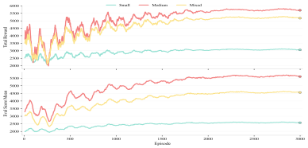
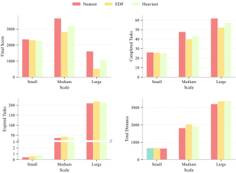
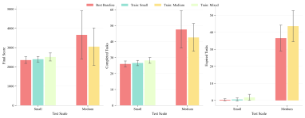

# README Layout Design: Dynamic Collaborative Scheduling System

> 基于 DSHW.pptx 叙事结构和 Figure/ 目录素材，优化 README 的视觉布局方案

---

## 1. 素材清单

| 文件 | 类型 | 大小 | 用途 |
|------|------|------|------|
| `图片 1.png` | 架构图 | 880KB | 系统整体框架图（对应PPT Slide 8） |
| `Comparison.png` | 对比图 | 20KB | 多策略实验对比结果 |
| `Comparison2.png` | 对比图 | 10KB | 补充对比实验（消融/充电策略等） |
| `Converge_curve.png` | 收敛曲线 | 33KB | Q-learning 训练收敛曲线 |
| `Nearest Task First.mp4` | 演示视频 | 35MB | NTF 策略动态仿真演示 |
| `Earliest-Deadline-First .mp4` | 演示视频 | 38MB | EDF 策略动态仿真演示 |
| `Maximum-Weight-First.mp4` | 演示视频 | 37MB | MWF 策略动态仿真演示 |

**注意**: 视频文件较大（35-38MB），GitHub README 不宜直接引用原始 mp4。建议转换为 GIF 或上传至 YouTube/哔哩哔哩后嵌入链接。

---

## 2. README 整体布局

### 2.1 视觉层级设计

```
┌──────────────────────────────────────────────────────┐
│  Title + 架构图 (图片 1.png)                           │  ← 首屏冲击
├──────────────────────────────────────────────────────┤
│  Abstract                                             │  ← 文字概述
├──────────────────────────────────────────────────────┤
│  Problem Setting (配图: 问题场景示意)                    │  ← PPT Slide 5-7 内容
├──────────────────────────────────────────────────────┤
│  Framework Overview                                   │  ← 引用 图片 1.png 详述
├──────────────────────────────────────────────────────┤
│  ── Path Planning (PPT Slide 13)                     │
│  ── Heuristic Strategies (PPT Slide 12,14 + 视频)     │  ← 核心方法
│  ── RL & MILP (PPT Slide 15 + Converge_curve.png)    │
├──────────────────────────────────────────────────────┤
│  Experiments (Comparison.png + Comparison2.png)      │  ← 实验结果
├──────────────────────────────────────────────────────┤
│  Repository Structure                                 │
├──────────────────────────────────────────────────────┤
│  Quick Start                                          │  ← 精简命令
└──────────────────────────────────────────────────────┘
```

---

## 3. 各区块详细布局

### 3.1 首屏：Title + 架构图

**目的**: 读者打开 GitHub 3 秒内理解项目是什么

```markdown
# Dynamic Collaborative Scheduling System for New Energy Logistics Fleets

<p align="center">
  
</p>

> Graph-based simulation engine + Heuristic & RL scheduling + MILP offline baseline
> — for dynamic new energy logistics fleet scheduling in urban road networks
```

**说明**: `图片 1.png` 是 PPT Slide 8 的架构总览图，放在标题下方作为 hero image，直接展示系统的完整架构（Simulation Engine → Backend → Frontend + RL/MILP 模块）。

---

### 3.2 Abstract（精简版）

保留当前 Abstract 但缩减为 4-5 行，作为项目定位说明。不再需要大段文字，因为架构图已经给了直观印象。

---

### 3.3 Problem Setting（问题建模）

**对应 PPT Slide 5-7**，用文字 + 公式/列表描述三大建模要素：

```markdown
## Problem Setting

### Dynamic Task Model
- Release time, location, cargo weight, deadline
- Tasks arrive dynamically during simulation

### EV Fleet Model  
- Battery capacity, energy consumption rate, load capacity
- Charging time, range anxiety constraints

### Road Network Graph
- Weighted graph G=(V,E)
- Nodes: task points, charging stations, depot
- Edges: distance cost + driving energy cost
```

此部分当前 README 缺失，需要补充。参考 PPT Slide 7 的 Road Network 图（如 Figure 中有对应图片可添加）。

---

### 3.4 Framework Overview（框架总览）

**引用图片**: `Figure/图片 1.png`

```markdown
## Framework

<p align="center">
  
</p>

The system follows a **Simulation Engine + Backend + Frontend** architecture:

- **Engine Layer**: Graph-based discrete-time simulation kernel
- **Policy Layer**: Heuristic schedulers (NTF, EDF, MWF) + Q-learning hyper-heuristic + offline MILP
- **Service Layer**: FastAPI + WebSocket realtime backend
- **UI Layer**: Next.js map visualization frontend
```

---

### 3.5 核心方法（三段式）

**对应 PPT Slide 12-15**，分三个子模块，每个子模块配图：

#### 3.5.1 Path Planning（路径规划）

**参考 PPT Slide 13**：

```markdown
### Path Planning

Shortest path on energy-constrained weighted graph.

| Algorithm | Type | Use Case |
|-----------|------|----------|
| Dijkstra  | Stable baseline | General shortest path |
| A*        | Heuristic accelerated | Large-scale maps |
| RRT       | Sampling-based | Continuous space + obstacles |

Unified objective: min cost under **energy feasibility** (remaining battery ≥ path cost)
```

#### 3.5.2 Heuristic Scheduling Strategies（启发式调度策略）

**参考 PPT Slide 12, 14**，配演示视频/GIF：

```markdown
### Heuristic Scheduling Strategies

Three scoring-based schedulers under the same framework:

| Strategy | Scoring Criterion | Strength | Weakness |
|----------|-------------------|----------|----------|
| **Nearest Task First (NTF)** | min travel distance | Fast response, low energy | Ignores deadlines |
| **Earliest Deadline First (EDF)** | min slack time | Fewer expired tasks | Ignores distance/cost |
| **Maximum Weight First (MWF)** | max cargo weight | High value per trip | Weakest urgency response |

#### Demo Videos

<p align="center">
  <table>
    <tr>
      <td align="center"><b>Nearest Task First</b></td>
      <td align="center"><b>Earliest Deadline First</b></td>
      <td align="center"><b>Maximum Weight First</b></td>
    </tr>
    <tr>
      <td></td>
      <td></td>
      <td></td>
    </tr>
  </table>
</p>
```

**注意事项**:
- 视频需转换为 GIF（建议用 ffmpeg 截取关键片段，控制 < 5MB 每个）
- 或上传至视频平台后在 README 放链接 + 封面图

#### 3.5.3 Q-Learning Hyper-Heuristic + MILP

**参考 PPT Slide 15**，配收敛曲线：

```markdown
### Q-Learning Hyper-Heuristic

Event-driven Gymnasium environment. The agent selects from the rule library at each decision point.

**State Features**: Task backlog, Urgency pressure, Fleet battery level, Station queue status

**Action Space**: {NTF, EDF, MWF, Charge-Nearest, Charge-Optimal}

<p align="center">
  
</p>

### Offline MILP Baseline

Full-information exact optimization (Gurobi/COIN) for small-scale oracle comparison.
```

---

### 3.6 Experiments（实验对比）

**引用图片**: `Figure/Comparison.png` + `Figure/Comparison2.png`

```markdown
## Experiments

### Experiment Scales

| Scale  | Vehicles | Tasks | Stations | Road Nodes | Horizon |
|--------|----------|-------|----------|------------|---------|
| Small  | 5        | 30    | 2        | 25         | 180     |
| Medium | 10       | 100   | 4        | 60         | 300     |
| Large  | 20       | 300   | 8        | 120        | 480     |

### Results

<p align="center">
  
</p>

<p align="center">
  
</p>

### Key Findings (from PPT Slide 17)
1. **Nearest is the most robust**: NTF performs consistently across all scales
2. **Q-learning excels in small-scale**: learned policy outperforms individual heuristics
3. **Charging strategies matter more for learning-based methods**
```

---

### 3.7 Repository Structure（保留当前）

保留当前的目录树，这是技术文档的核心参考。

---

### 3.8 Quick Start（精简版）

将当前冗长的命令部分精简，保留最核心的 4 步：

```markdown
## Quick Start

### 1. Install
conda create -n datastructure python=3.10 -y && conda activate datastructure
pip install -r requirements.txt

### 2. Run Baseline
cd Engine
python -m Framework.examples.run_baseline --scale small --scheduler nearest

### 3. Train Q-Learning
PYTHONPATH="$PWD/Engine:$PWD" python -m policy.gymnasium_qlearning.train_q_learning --scale small --episodes 200

### 4. Launch Visualization
cd UI/logistics-ui && npm install && npm run dev
```

完整命令保留在 README.zh-CN.md 或 docs/ 中。

---

## 4. 实施步骤

### Step 1: 视频转 GIF
```bash
# 截取 5-10s 关键片段，转换为 GIF
ffmpeg -i "Figure/Nearest Task First.mp4" -t 8 -vf "fps=10,scale=480:-1" Figure/NTF_demo.gif
ffmpeg -i "Figure/Earliest-Deadline-First .mp4" -t 8 -vf "fps=10,scale=480:-1" Figure/EDF_demo.gif
ffmpeg -i "Figure/Maximum-Weight-First.mp4" -t 8 -vf "fps=10,scale=480:-1" Figure/MWF_demo.gif
```

### Step 2: 图片重命名（推荐）
将中文文件名改为英文，便于 README 引用：
- `图片 1.png` → `framework.png`
- `Converge_curve.png` → `convergence.png`（或保持）

### Step 3: 按布局重写 README.md
按上述 Section 3 的详细布局，从 top to bottom 重写 README.md。

### Step 4: 同步更新 README.zh-CN.md
中文版 README 保持相同结构，仅翻译文字内容。

---

## 5. 布局对比总结

| 维度 | 当前 README | 优化后 README |
|------|------------|--------------|
| 首屏 | 纯文字标题 | 标题 + 架构图，3秒定位 |
| 方法描述 | 散落在各处 | 三模块清晰分区(Path/Heuristic/RL) |
| 策略对比 | 无 | 表格对比 + 演示视频 |
| 实验结果 | 无视觉 | Comparison.png + Comparison2.png |
| 收敛曲线 | 无 | Converge_curve.png |
| 命令长度 | 过长，多处重复 | 精简为 Quick Start，详细归入文档 |
| 叙事线 | 命令行手册风格 | Background→Problem→Method→Experiment 学术叙事 |
